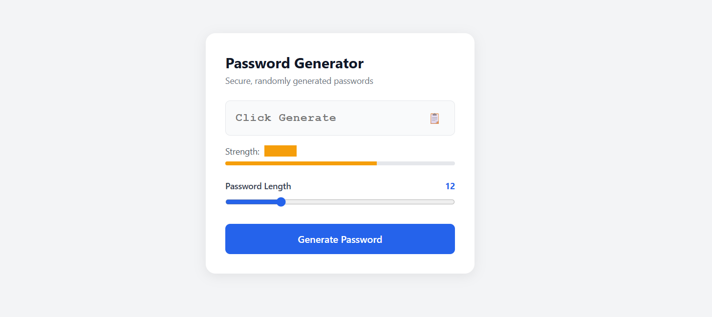

# Python Password Generator

A simple Python project that generates random passwords using letters, numbers, and special characters.

## Features
- User chooses password length
- Generates strong random passwords
- Includes:
  - Uppercase letters
  - Lowercase letters
  - Numbers
  - Special characters
- Beginner-friendly Python project

## Technologies Used
- Python 3

## How to Run

1. Clone this repository:

```bash
git clone https://github.com/YOUR_USERNAME/YOUR_REPOSITORY.git
````

2. Open the project folder:

```bash
cd YOUR_REPOSITORY
```

3. Run the program:

```bash
python password_generator.py
```

## Example Output

```text
Enter password length: 12

Generated Password:
A7@kP1!xQ9#m
```
## Screenshot



## What I Learned

* Python basics
* Random module
* User input handling
* String manipulation
* Basic project structure
* GitHub project uploading

## Future Improvements

* GUI version
* Save passwords to file
* Password strength checker
* Multiple password generation

## Author

Made by 

Tooba Ali

CyberSecurity Enthusiast | Python Developer

```
```
